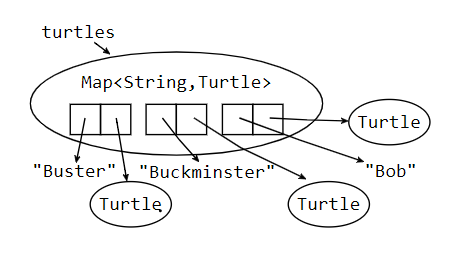

# 읽기2: 자바 기본(Basic Java)

## 오늘 수업의 주제

- 자바의 기본 문법과 의미(semantics)
- 파이썬 작성에서 자바 작성으로 전환(transition)

## 6.005의 소프트웨어

| 버그로부터 안전한                       | 이해하기 쉬운                                             | 바꿀 준비가 되어 있는                                     |
| :-------------------------------------- | --------------------------------------------------------- | --------------------------------------------------------- |
| 오늘도, 언젠가의 미래에도 올바르게 동작 | 당신 스스로를 포함한, 미래의 프로그래머들과 명확하게 소통 | 새로 다시 작성하지 않아도 변경을 수용 할 수 있도록 디자인 |

## 자바 튜토리얼로 시작하기(Getting started with the Java Tutorials)

다음 몇몇 섹션은 여러분들이 자바의 기본을 배울 수 있는 [튜토리얼](https://docs.oracle.com/javase/tutorial/index.html)의 링크입니다.

위의 튜토리얼 대신 [Getting Started: Learning Java](https://ocw.mit.edu/ans7870/6/6.005/s16/getting-started/java.html)를 보여도 좋습니다.

이번 읽기와 다른 자료들에서 자주 [자바 API 문서(Java API documentation)](https://docs.oracle.com/javase/8/docs/api/)를 언급할 것입니다. 이는 자바에 있는 모든 클래스들의 설명이 적힌 문서입니다.

## 언어 기초(Language basics)

> [언어기초](https://docs.oracle.com/javase/tutorial/java/nutsandbolts/index.html)를 읽으세요.

여러분은 다음의 언어 기초에 관한 네가지 *질문과 연습*페이지의 문제들에 답할 수 있어야합니다.

- [질문: 변수(Variables)](https://docs.oracle.com/javase/tutorial/java/nutsandbolts/QandE/questions_variables.html)
- [질문: 연산자(Operators)](https://docs.oracle.com/javase/tutorial/java/nutsandbolts/QandE/questions_operators.html)
- [질문: 표현, 구문, 블록(Expressions, Statements, Blocks)](https://docs.oracle.com/javase/tutorial/java/nutsandbolts/QandE/questions_expressions.html)
- [질문: 제어 흐름(control flowe)](https://docs.oracle.com/javase/tutorial/java/nutsandbolts/QandE/questions_flow.html)

각각의 *질문과 연습*페이지의 아래에 해답의 링크가 있음을 기억하세요.

파이썬의 기본과 자바의 기본이 어떻게 다른지 질문에 답해가며 자신의 이해 수준을 점검해 보세요.

## 숫자와 문자열(Numbers and strings)

> [숫자와 문자열](https://docs.oracle.com/javase/tutorial/java/data/index.html)을 읽으세요.

`Number`클래스에 대해 혼동이 와도 걱정하지 마세요, 원래 그렇습니다..

여려분들은 다음 두가지 *질문과 연습*페이지에 답변 할 수 있어야 합니다.

- [질문: 숫자(Numbers)](https://docs.oracle.com/javase/tutorial/java/data/QandE/numbers-questions.html)
- [질문: 문자, 문자열(Characters, Strings)](https://docs.oracle.com/javase/tutorial/java/data/QandE/characters-questions.html)

## 클래스와 객체(Classes and objects)

> [클래스와 객체](https://docs.oracle.com/javase/tutorial/java/javaOO/index.html)를 읽으세요.

여러분들은 다음 두 *질문과 연습*페이지에 답변 할 수 있어야 합니다.

- [질문: 클래스(Classes)](https://docs.oracle.com/javase/tutorial/java/javaOO/QandE/creating-questions.html)
- [질문: 객체(Objects)](https://docs.oracle.com/javase/tutorial/java/javaOO/QandE/objects-questions.html)

_중첩 클래스(Nested Classes)_ 와 *Enum 타입*이 지금 당장 완전히 이해되지 않아도 괜찮습니다. 앞으로 우리 수업이 진행되다가 이 둘이 나오게 되면 여기서 다시 확인해보세요.

## Hello, world!

> [Hello World]()를 읽으세요.

여러분들은 튜토리얼 페이지에 있는 코드를 통해 새 `HelloWorldApp.java`파일을 만들고, 컴파일, 실행하여 콘솔창에 `Hello World!`가 표시되게끔 할 수 있어야 합니다.

---

## 스냅샷 다이어그램(Snapshot diagrams)

몇몇 세밀한 질문들에 답변하기 위해서는, 런타임에 무슨 일이 일어나고 있는지 그림을 그려보는 것이 유용합니다. **_스냅샷 다이어그램(Snapshot diagrams)_**는 런타임중인 프로그램의 내부 상태를 나타냅다. 그 프로그램의 내부 상태란, 스택(stack, 처리중인 메소드들과 지역 변수들)과 힙(heap, 현재 존재하는 객체들)을 말합니다.

우리가 6.005에서 스냅샷 다이어그램을 사용하는 이유는 다음과 같습니다:

- (수업과 팀 회의에서) 그림을 통해 서로 대화하기 위해
- 다음과 같은 개념들을 설명/표현(illustrate) 하기 위해
  - 원시타입(primitive types) vs. 객체 타입(object types)
  - 불변성 값(immutable values) vs. 불변성 참조(immutable references)
  - 포인터 앨리어싱(pointer aliasing), 스택(stack) vs. 힙(heap)
  - 추상화(abstractions) vs. 구체적 표현(concrete representations)
- 여러분의 디자인을 여러분들의 팀 프로젝트(여러분들과 여러분들의 TA에게)에 설명하는데 도움이 되도록
- 후속 강좌에서 더 풍부한 디자인 표기법을 위한 길을 닦아두기 위해서. 예를 들어 스냅샷 다이어그램은 코스 6.170에서 객체 모델로 일반화됩니다.

비록 이 코스에서 사용되는 다이어그램은 자바의 예시를 사용하지만, 표기법 자체는 현대 프로그래밍언어(Python, Javascript, C++, Ruby) 모두에 적용 할 수 있습니다.

## 원시 값(Primitive values)

원시 값은 순수한 정수로 표현 됩니다. 안으로 향하느 화살표는 변수나 객체 필드로부터의 참조를 나타냅니다.


## 객체 값(Object values)

객체 값은 그 타입에 따라 원으로 표시(labeled)되어 있습니다. 더 구체적으로 나타내고 싶을때 , 그 안에 필드의 이름을, 화살표로 외부의 값을 가리키도록 그리면 됩니다. 더 자세히 나타내려면, 각 필들의 선언 타입을 적을 수도 있습니다. 어떤 사람들은 `int x`로 적기보다 `x: int`로 적기를 더 좋아합니다. 둘 다 괜찮습니다.


## 값 변경 vs. 값 재할당(Mutating values vs. reassigning variables)

스냅샷다이어그램은 변수를 바꾸는 것과 값을 바꾸는 것의 차이첨을 시각화 할 수 있는 방법을 제공합니다.

- 변수나 필드에 값을 할당하면, 우리는 변수의 화살표가 가리키는 곳을 바꿉니다. 다른 값에 화살표가 향하게끔 하는 것이죠.
- 변경가능한 컨텐츠(배열이나 리스트같은)에 값을 재할당하는 경우, 여러분은 그 값 안의 참조를 바꾸게 됩니다.

**재할당과 불변성 값(Reassignment and immutable values)**

예를 들어, `String`변수 `s`에 값을 `"a"`에서 `"ab"`로 재할당 할 수 있습니다.

```java
String s = "a";
s = s + "b";
```

`String`은 *불변성*타입의 예시입니다. 한번 만들고 나면 그 값을 절대 변경 할 수 없는 타입이죠. 불변성(변화에 대한 내성)은 이 코스의 중요한 디자인 원리 입니다. 이에 대해서는 추후의 읽기시간에 이야기하도록 하겠습니다.

불변성 객체(언제나 같은 값을 나타내도록 디자이너에 의해 의도된)는 스냅샷 다이어그램에서 두줄의 윤곽선으로 표시합니다. 우리의 다이어그램의 `String`객체처럼 말이죠.


**가변성 값(Mutable values)**

이와 대조적으로, `StringBuilder`(자바의 다른 빌트인(built-in)클래스)는 *가변성(mutable)*객체입니다. `String`처럼 문자열을 나타내면서, 그 객체의 값을 변경할 수 있는 메소드를 가지고 있습니다.

```java
StringBuilder sb = new StringBuilder("a");
sb.append("b");
```

이 둘의 스냅샷다이어그램은매우 다르게 생겼습니다. 아주 좋은 일이죠 : 불변성과 가변성의 차이점은 우리의 코드를 **_버그로부터 안전하게_** 하는데 매우 중요한 역할을 맡게 될 것입니다.


**불변성 참조(Immutable references)**

자바는 또한 불변성 참조를 제공합니다: 한번 값을 할당하면 다시는 재할당 할 수 없는 변수죠. 참조를 불변으로 하고 싶으면, 키워드 `final`과 함께 선언하면 됩니다:

```java
final int n = 5;
```

여러분들의 `final`변수가 런타임중에 한번만 할당된다고 생각되지 않으면, 자바 컴파일러는 컴파일 오류를 발생시킬 것입니다. 따라서 `final`은 불변성 참조의 정적 검사를 제공해줍니다.

스냅샷 다이어그램에서, 불변성 참조(`final`)은 이중화살표로 나타냅니다. 여기 `id`는 절대 변하지 않으며(다른 숫자를 절대 재할당 할 수 없습니다.), `age`는 변경 가능한 객체를 나타내보았습니다.

*가변성 값(mutable value)*에도 *불변성 참조(immutable reference)*를 사용 할 수 있다는 점(예를 들어: `final StringBuilder sb`)을 기억하세요. (같은 객체를 가리키면서 그 값은 변할 수 있습니다(whose value can change even though we're pointing to the same object).)

또한 *불변성 값(immutable value)*에 _가변성 참조(mutable reference)_ (예를 들어 `String s`)를 사용할 수도 있습니다. 변수의 값은 다른 객체를 새로 가리키므로써 변경 될 수 있는 것이죠.


---

## 자바 컬렉션(Java Collections)

우리가 제일 처음 다루었던 자바 언어 기초는 *고정길이(fixed-length)*의 원시타입/객체의 컨테이너인 [배열](https://docs.oracle.com/javase/tutorial/java/nutsandbolts/arrays.html)이었습니다. 자바는 객체의 *컬렉션*을 다루는 더 강력하고 유연한 도구들을 제공합니다. 그것이 **자바 콜렉션 프레임워크(Java Collections Framework)**이죠.

### Lists, Sets, 그리고 Maps

[자바의 `리스트`](https://docs.oracle.com/javase/8/docs/api/?java/util/List.html)는 [파이썬의 리스트](https://docs.python.org/3/library/stdtypes.html#sequence-types-list-tuple-range)와 비슷합니다. `리스트`는 0개 이상의 순서가 정해진(ordered) 객체의 컬렉션이며 동일한 객체가 여러 번 나타날 수 있습니다. 또한 `리스트`의 항목을 추가하거나 삭제 할 수 있습니다. 그에 따라 `리스트`의 크기는 커지거나 줄어들죠.

아래에 `리스트`의 동작(operation)예시를 봅시다.

| Java                      | description                   | Python             |
| ------------------------- | ----------------------------- | ------------------ |
| `int count = lst.size();` | 요소의 개수를 셈              | `count = len(lst)` |
| `lst.add(e);`             | 리스트의 마지막에 요소를 추가 | `lst.append(e)`    |
| `if (lst.isEmpty()) ...`  | 리스트가 비어있는지 테스트    | `if not list: ...` |

아래의 스냅샷 다이어그램에서, `List`는 인덱스들이 필드에 그려진 객체로 묘사됩니다.


이 `cities`의 리스트는 아마도 Boston 에서 Bogota, Barcelona로 가는 여행을 나타낸 것 같습니다.

**[`Set`](https://docs.oracle.com/javase/8/docs/api/?java/util/Set.html)는 0개 이상의 순서가 없는(unordered) 무이한(unique) 객체들의 컬렉션입니다.** 수학에서의 집합(set)나 [파이썬의 set](https://docs.python.org/3/library/stdtypes.html#set-types-set-frozenset)와 같이 (`List`와는 다르게) set에서는 동일한 객체가 여러번 나올 수 없습니다. 있거나 없거나 둘 중 하나 입니다.

아래에 `Set`의 동작(operations) 예시를 봅시다.

| Java                  | description                         | Python                                     |
| --------------------- | ----------------------------------- | ------------------------------------------ |
| `s1.contains(e);`     | 세트에 요소가 포함되어있는지 테스트 | `e in s1`                                  |
| `s1.containsAll(s2);` | s2가 s1에 속하는지(s1⊇s2) 테스트    | `s1.issuperset(s2)`<br />`s1 >= s2`        |
| `s1.removeAll(s2)`    | s1에서 s2를 삭제                    | `s1.difference_update(s2)`<br />`s1 -= s2` |

스냅샷 다이어그램에서 `Set`는 이름이 없는 객체들의 필드로 묘사됩니다.


위에 그림에서 순서가 없는 정수 42, 1024, -7의 세트가 그려져 있습니다.

**[`Map`](https://docs.oracle.com/javase/8/docs/api/?java/util/Map.html)은 [파이썬의 dictionary](https://docs.python.org/3/library/stdtypes.html#mapping-types-dict)와 비슷합니다.** 파이썬에서 map의 **키(keys)**는 반드시 [해쉬가능(hasable)](https://docs.python.org/3/glossary.html#term-hashable)이어야 합니다. 자바 또한 비슷한 요구가 있습니다. 자바 객체간에 equality가 어떻게 동작하는지 알아보면서 더 이야기 하겠습니다.

아래에 `Map`의 동작예시를 봅시다.

| Java                   | description                       | Python           |
| ---------------------- | --------------------------------- | ---------------- |
| `map.put(key, val)`    | key → val mapping을 추가          | `map[key] = val` |
| `map.get(key)`         | 키의 값을 취득                    | `map[key]`       |
| `map.containsKey(key)` | map에 해당 키가 존재하는지 테스트 | `key in map`     |
| `map.remove(key)`      | mapping을 삭제                    | `del map[key]`   |

스냅샷 다이어그램에서, `Map`은 key/value쌍(pair)의 객체들이 포함된 모습으로 묘사됩니다.



이 `turtles` map은 `String`의 key(Bob, Buckminster, Buster)에 할당된`Turtle` 객체들을 포함합니다

## Literals

파이썬은 리스트를 작성하느 편리한 문법을 제공합니다.

```python
lst = [ "a", "b", "c" ]
```

그리고 map또한

```python
map = { "apple": 5, "banana": 7 }
```

**자바는 그렇지 않습니다.** 배열을 위한 리터럴(literal) 문법은 제공합니다.

```java
String[] arr = { "a", "b", "c" };
```

하지만 이것은 `List`가 아닌 *배열(array)*를 생성하죠. 배열로부터 `List`를 생성하기 위해서는 [provided utility function](https://docs.oracle.com/javase/8/docs/api/?java/util/Arrays.html)을 사용해야 합니다.

```java
Arrays.asList(new String[] { "a", "b", "c" })
```

`Array.asList`를 통해 만들어진 `List`에는 제한사항이 있습니다. 그 길이가 고정되어 있죠.

## 제네릭: List, Set, 그리고 Map 변수 선언하기(Generics: declaring List, Set, and Map variables)

파이썬의 컬렉션 타입(collection types)와는 다르게 자바 컬렉션에서는 컬렉션에 수용되는 객체의 타입을 제한 할 수 있습니다. 항목(item)을 추가할 때, 자바 컴파일러는 적절한 타입의 항목이 추가 되는지 *정적 검사*를 수행 할 수 있습니다. 그리고, 우리가 항목을 꺼낼 때, 예상한 타입이 나온다는 것을 보장 받을 수 있습니다.

아래에 컬렉션을 위한 변수 선언의 문법이 적혀 있습니다:

```java
List<String> cities;		// a List of Strings
Set<Integer> numbers;		// a Set of Integers
Map<String,Turtle> turtles; // a Map with String keys and Turtle values
```

제네릭(generics)의 동작 방식 때문에, 우리는 원시타입의 컬렉션은 만들 수 없습니다. 예를들어, `Set<int>`는 *불가능*합니다. 대신 전에 보았듯이, `int`대신에 사용할 수 있는 `Integer`가 있습니다.(예시. `Set<Integer> numbers`)

이러한 유형의 컬렉션을 쉽게 사용할 수 있도록, 자바는 자동 변환을 해줍니다. 만약 `List<Integer> sequence`와 같은 변수를 선언했다면, 아래와 같이 사용할 수 있습니다:

```java
sequence.add(5);				// add 5 to the sequence
int second = sequence.get(1);	// get the second element
```

## List만들기: ArrayList와 LinkedList(ArrayLists and LinkedLists: creating Lists)

지금까지 봐 왔듯이, 자바는 타입의 _사양(specification)_-무엇을 하는가 와 _구현(implementation)_-코드는 무엇인가 를 구별 할 수 있도록 해줍니다.

`List`, `Set`, 그리고 `Map`은 모두 *인터페이스(interfaces)*입니다. 그들은 각각의 타입이 어떻게 행동해야 하는지는 정의해주지만, 직접적인 구현 코드(implementation code)를 제공하지는 않습니다. 이에는 몇몇 장점이 있습니다. 그 중 하나는, 유저가 이러한 타입들을, 각기 다른 상황에 각기 다른 형태의 구현(implementation)을 선택 할 수 있다는 것입니다.

아래에 실제 `List`를 만드는 방법입니다:

```java
List<String> firstNames = new ArrayList<String>();
List<Stirng> lastNames = new LinkedList<String>();
```

만약 왼쪽 오른쪽의 제네릭 타입 인수가 동일하다면 , 자바는 그것을 인지하고 다음과 같이 코드를 줄일 수 있습니다:

```java
List<String> firstNames = new ArrayList<>();
List<String> lastNames = new LinkedList<>();
```

[`ArrayList`](https://docs.oracle.com/javase/8/docs/api/?java/util/ArrayList.html)와 [`LinkedList`](https://docs.oracle.com/javase/8/docs/api/?java/util/LinkedList.html)는 `List`의 두 가지 형태의 구현입니다. 둘 모두 `List`의 동작을 제공합니다. 그리고 그 모든 동작들은 `List`의 문서에 서술된대로 동작해야만 합니다. 예를 들어, `firstNames`와 `lastNames`는 동일하게 동작해야합니다: 우리가 만약 각각 사용된 `ArrayList` 와 `LinkedList`를 서로 뒤바꾸어도 코드는 망가지지 않습니다.

불행히도, 이렇게 선택을 할 수 있다는 것은 짐이 되기도 합니다. 우리는 파이썬의 list가 어떻게 잘 동작했는지 신경 쓰지 않았었습니다. 우리가 왜 자바 list가 `ArrayLists` 혹은 `LinkedLists`인지 신경 써야 하나요? 그 둘의 유일한 차이점은 성능 뿐이므로, 6.005에서는 신경을 끄도록 합니다.

잘 모르겠을 때는, 그냥 `ArrayList`를 쓰세요.

## Set와 Map만들기: HashSet과 HashMap(HashSets and HashMaps: creating Sets and Maps)

`Set`를 위한 우리의 기본 선택은 [`HashSet`](https://docs.oracle.com/javase/8/docs/api/?java/util/HashSet.html)입니다.

```java
Set<Integer> numbers = new HashSet<>();
```

자바는 또한 [`TreeSet`](https://docs.oracle.com/javase/8/docs/api/?java/util/TreeSet.html)의 구현으로서 [sorted sets](https://docs.oracle.com/javase/8/docs/api/?java/util/SortedSet.html)를 제공합니다.

그리고 `Map`을 위한 우리의 기본 선택은 [`HashMap`](https://docs.oracle.com/javase/8/docs/api/?java/util/HashMap.html)입니다.

```java
Map<String,Turtle> turtles = new HashMap<>();
```

## 반복(Iteration)

이제 우리는 아래의 코드가 생겼습니다.

```java
List<String> cities			= new ArrayList<>();
Set<Integer> numbers		= new HashSet<>();
Map<String,Turtle> turtles	= new HashMap<>();
```

가장 흔한 작업(task)은 이 cities/numbers/turtles/etc를 반복(iterating)하는 것입니다.

파이썬에서는:

```python
for city in cities:
    print city

for num in numbers:
    print num

for key in turtles:
    print "%s: %s" % (key, turtles[key])
```

자바 또한 `List`와 `Set`의 항목을 반복(iterate) 할 수 있는 비슷한 문법을 제공합니다:

```java
for (String city : cities) {
    System.out.println(city);
}

for (int num : numbers) {
	System.out.println(num);
}
```

이 방법으로 `Map`을 반복 할 순 없지만, 파이썬에서 한 것처럼 key를 반복 할 수 있습니다.

```java
for (String key : turtles.keySet()) {
	System.out.println(key + ": " + turtles.get(key));
}
```

내부적으로는 이러한 `for`루프는 [`Iterator`](https://docs.oracle.com/javase/8/docs/api/?java/util/Iterator.html)를 사용합니다. 이러한 디자인 패턴은 추후의 수업에서 살펴보도록 하겠습니다.

## 인덱스와 함께 반복하기(Iterating with indices)

여러분이 원한다면, 자바는 인덱스를 이용해 list를 반복 할 수 있는 다른 `for`루프를 제공합니다.

```java
for (int ii = 0; ii < cities.size(); ii++) {
	System.out.println(cities.get(ii));
}
```

인덱스의 실제 값인 `ii`가 필요하지 않는 이상, 이러한 코드는 너무 길고(verbose) 버그가 숨을 곳이 많습니다. 피하세요.

## 자바 API 문서(Java API documentation)

앞선 섹션에서는 [Java platform API ](https://docs.oracle.com/javase/8/docs/api/)의 일부 클래스의 문서 링크가 소개 되었습니다.

API 는 *application programming interface*의 약자입니다. 여러분이 페이스북과 상호작용하는 앱을 만들고 싶다면, 페이스북에서 발행한 API(사실 한가지는 아닙니다. 여러 언어와 프레임워크에 맞게 여러가지로 제공됩니다.)를 사용하여 프로그래밍 하면 됩니다. 자바 API는 일반적으로 유용한 거의 대부분의 프로그래밍 도구의 큰 모음집입니다.

- [**`java.lang.String `**](https://docs.oracle.com/javase/8/docs/api/?java/lang/String.html)은 `String `의 풀네임입니다. `"큰따옴표"`만 사용하는 것으로 `String `타입의 객체를 만들 수 있습니다.
- [**`java.lang.Integer `**](https://docs.oracle.com/javase/8/docs/api/?java/lang/Integer.html)
- [**`java.util.List `**](https://docs.oracle.com/javase/8/docs/api/?java/util/List.html)
- [**`java.util.Map `**](https://docs.oracle.com/javase/8/docs/api/?java/util/Map.html)
- [**`java.io.File `**](https://docs.oracle.com/javase/8/docs/api/?java/io/File.html)
- [**`java.io.FileReader `**](https://docs.oracle.com/javase/8/docs/api/?java/io/FileReader.html)
- [**`java.io.BufferedReader `**](https://docs.oracle.com/javase/8/docs/api/?java/io/BufferedReader.html)

[`BufferedReader `](https://docs.oracle.com/javase/8/docs/api/?java/io/BufferedReader.html)


[`HashMap `](https://docs.oracle.com/javase/8/docs/api/?java/util/HashMap.html) [`Map `](https://docs.oracle.com/javase/8/docs/api/?java/util/Map.html)


