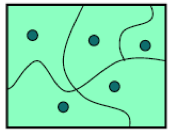
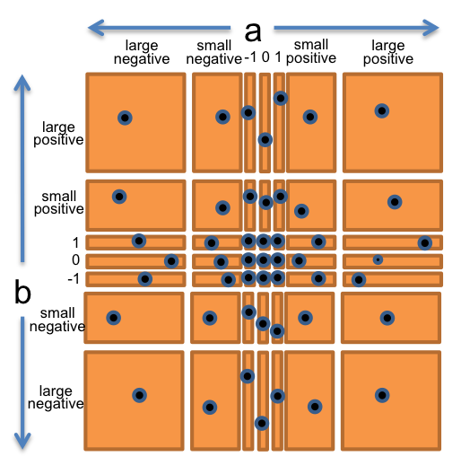
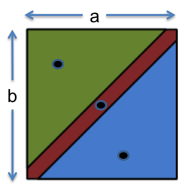

## 읽기 3: 테스팅(Testing)

6.005 소프트웨어

| 버그로부터 안전한               | 이해하기 쉬운                                             | 수정 가능한                                         |
| ------------------------------- | --------------------------------------------------------- | --------------------------------------------------- |
| 지금도 올바르고 미래에도 올바른 | 자신을 포함한 미래의 프로그래머와 명확하게 소통할 수 있는 | 다시 쓰지않아도 수정 사항을 수용할 수 있도록 디자인 |

## 오늘 수업의 주제

- 테스트의 가치를 이해하고, 테스트 우선(test-first) 프로그래밍의 과정을 알기
- 메소드의 입력과 출력 공간을 분리하고 좋은 테스트 케이스를 선택함으로서 테스트 스위트(test suite)를 디자인 할 수 있음
- 코드 커버리지(code coverage)를 측정함으로써 테스트 스위트를 평가(judge)할 수 있음
- 블랙박스 vs 화이트박스 테스트, 단위(unit) vs 결합(integretion) 테스트, 그리고 자동화된 회귀(regression) 테스트를 언제 사용해야 하는지 이해하기

## 확인(Validation)

테스팅이란 더 일반적(general) 과정인 확인(validation)의 한 예입니다. 확인(validation)의 목적은 프로그램의 문제들을 발견하고, 그럼으로써 프로그램의 정확성에 대한 자신감을 높이기 위함입니다. Validation에는 다음과 같은 것들이 있습니다.

- 보통 검증(verification)이라 부르는 **공식적인 추론(Formal reasoning)**. 검증(verification) 프로그램이 올바르다는 공식적인 증거들을 구성합니다. 검증은 손으로(by hand) 하기에는 굉장히 귀찮으며, 검증을 위한 자동화된 도구는 아직도 활발히 연구되는 분야입니다. 그럼에도 불구하고, 운영체제의 스케쥴러나 [파일시스템](https://www.csail.mit.edu/news/crash-proof-computer-systems), 가상머신의 바이트코드 인터프리터와 같이 프로그램의 작고 중요한 부분들이 공식적으로 검증될 수 있습니다.
- **코드 리뷰**. 다른 사람이 당신의 코드를 주의 깊게 읽고, 추론해 보는것은 버그를 찾아내기 좋은 방법입니다. 당신이 쓴 에세이를 다른 사람이 교정해주는 것과 비슷합니다. 다름 읽기에서 코드 리뷰에 대해서 더 자세히 이야기 하겠습니다.
- **테스팅**. 주의깊게 선택된 입력들을 프로그램에 구동시키고, 결과를 확인하는 것입니다.

최상의 검증을 통해서도, 소프트웨어에 완벽한 품질을 달성하는 것은 매우 어렵습니다. 다음은 일반적인 kloc(1000줄의 코드) 당 잔여 결함 비율(residual defect rates - 소프트웨어를 납품한 뒤에도 남아있는 버그들) 입니다.

- 1 - 10 결함/kloc : 일반적인 산업 소프트웨어
- 0.1 - 1 결함/kloc : 높은 품질의 검증, 자바 라이브러리가 이정도의 정확성을 가지고 있을것입니다.
- 0.01 - 0.1 결함/kloc : 아주 최상의, 안전에 중요한 검증. NASA나 Praxis와 같은 회사들이 이 단계를 달성합니다.

이는 대형 시스템에는 실망스러울 수 있습니다. 예를 들어, 여러분이 전형적인 백만줄 정도의 산업 소스 코드를 납품했다면 대부분 1000개의 버그를 (1결함/kloc) 놓쳤다는 이야기이니까요!

## 왜 소프트웨어 테스팅이 어려운가

불행히도 소프트웨어 세상에서 통하지 않는 방법으로는 다음과 같은 것들이 있습니다.

**철저한 테스트** 는 불가능합니다. 철저하게 테스트하기에는 가능한 테스트 케이스가 일반적으로 너무 거대합니다. 32비트의 부동소수점 곱셈 `a*b`에 대한 철저한 테스트를 생각해보세요. 2<sup>64</sup>가지의 테스트 케이스가 존재합니다!

**Haphazard 테스팅**("그냥 일단 잘 돌아가는지 확인해봐")은 프로그램에 버그가 너무너무 많아 임의로 선택한 입력이 성공보다 실패할 확률이 높은 경우 이외에는 버그를 찾아내기 힘듭니다. 또한 프로그램의 정확성에 대한 자신감을 늘려주지도 않죠.

**무작위 또는 통계적 테스트**는 소프트웨어에서는 잘 통하지 않습니다. 다른 엔지니어링 분야에서는 작은 무작위 샘플(예를 들어 제조된 하드드라이브의 1퍼센트)들을 테스트하는 것으로 전체 생산품의 결함율을 찾아 낼 수 있습니다. 물리적인 시스템은 속도를 내기위한 많은 방법들이 있습니다. 예를들어 냉장고를 10년동안 천번 열고 닫는 대신 24시간 동안 열고 닫을 수 있죠. 이러한 방편들을 통해 오류비율(예를들어 하드드라이브의 평균 수명)을 파악할 수 있습니다. 하지만 이것들은 연속적이고 균일한 결함을 가정합니다. 이런것들은 물리적인 제품들에는 잘 통합니다.

하지만 소프트웨어에서는 그렇지 않습니다. 소프트웨어는 입력가능한 모든 범위에 걸쳐 불연속적이고 개별적인 다양한 동작을 보입니다. 시스템은 광범위한 입력에 걸쳐 올바르게 동작하는가 하다가도, 돌연 하나의 경계지점에서 실패해버립니다. [유명한 Pentium division bug](https://www.willamette.edu/~mjaneba/pentprob.html)는 90억개의 division중 단 하나에 영향을 미쳤습니다. 스택오버플로우, 메모리 초과(out of memory) 에러, 산술오버플로우(numeric overflow) 버그들은 항상 갑작스럽고 확률범위 밖에서 발생하는 경향이 있습니다. 물리적 시스템은 다릅니다. 시스템이 실패지점으로 향하고 있는 것을 눈으로 확인 할 수 있는 경우(다리에 금이 가는 경우처럼)나, 확률적인 실패 범위 주위에서 실패가 발생하는 경우가 많죠.(그래서 심지어 실패를 확인하기도 전에 통계적으로 예측 할 수 있는 경우도 있습니다.)

대신해서, 테스트 케이스는 신중하고, 체계적으로 선택되어야 하며, 그것이 우리가 다음으로 배울 것입니다.

## 테스트 모자 쓰기(Putting Your Testing Hat)

테스트를 하기 위해서는 그에 맞는 자세를 갖추어야 합니다. 여러분이 코딩을 할 때는 그 목표가 프로그램이 잘 동작하도록 하는 것이지만, 여러분이 테스트를 할 때는 그것이 **실패**하도록 하는것이 목표가 되어야 합니다.

거기에는 작지만 중요한 차이점이 있습니다. 여러분이 방금 작성한 코드가 매우 소중하고 연약한 달걀로 보이며 그래서 그저 동작하는지만 가볍게 확인하고 싶게 되기 쉽습니다.

하지만, 여러분은 잔인해져야합니다. 좋은 테스터는 망치를 휘두르며, 프로그램에 취약할 만한 곳을 모조리 부숴버립니다. 그렇게 함으로써 취약점이 사라지게 됩니다.

## 테스트-우선 프로그래밍(Test-first Programming)

테스트를 일찍 그리고 자주 하세요. 거대한 검증되지 않은(unvalidated)코드 덩어리가 생겨버릴 때까지 테스트를 미루지 마세요. 테스트를 마지막에 남겨두는것은 디버깅을 더 길고 고통스럽게 할 뿐입니다. 버그가 어디에든 존재하기 때문이죠. 개발을 하는 동시에 테스트를 하는 편이 훨씬 편안할 것입니다.

테스트 우선 프로그래밍에서는 코드를 작성하기도 전에 먼저 테스트를 작성합니다. 하나의 함수(function, 기능)을 개발하는 과정은 다음과 같은 순서로 진행됩니다.

1. 기능의 사양(specification)을 적는다.
2. 그 사양을 실행하는 테스트를 작성한다.
3. 실제 코드를 작성한다. 작성한 테스트를 코드가 통과하면 끝난 것입니다.

**사양(specification)**은 기능(함수)의 입출력 동작에 관한 것입니다. 인수의 타입과 추가적인 제한사항(예를들어 `sqrt`의 인수는 양수이어야 한다 같은)을 정해줍니다. 또한 리턴 값이 어떤 타입인지 그리고 그 값이 입력값과 어떻게 연관 되어 있는지 알려줍니다. 여러분은 이미 이 강의에서 이러한 사양을 본적이 있습니다. 코드에서 사양은 메서드의 시그니쳐(method signiture)와 그 동작을 설명하는 코멘트로 구성됩니다. 사양에 대해서는 앞으로 몇몇 강의에서 더 이야기 할 것입니다.

테스르를 먼저 적는 것은 사양을 이해하기 위한 좋은 방법입니다. 사양 또한 buggy할 수 있습니다. 부정확하고, 불완전하거나, 모호하거나 혹은 특정한 경우를 놓쳤을 수도 있죠. 테스트를 작성하다보면 이러한 문제들을 빨리 발견하고, 애초에 잘못된 사양에 맞춰 코드를 작성하는 시간 낭비를 줄여줄 수 있습니다.

## 파티셔닝으로 테스트 케이스 고르기(Choosing Test Cases by Partitioning)

좋은 테스트 suite를 작성하는것은 어렵고 흥미로운 디자인 문제입니다. 우리는 빠르게 실행할 수 있을 만큼 충분히 작지만, 프로그램을 검증하기에는 충분히 큰 테스트 케이스 모음을 선별할 것입니다.

먼저, 우리는 입력범위를 **서브도메인(subdomains)**으로 나눌 것입니다. 각 서브도메인은 입력들의 집합이죠. 모든 입력이 최소한 하나의 서브도메인에는 들어가 있도록, 각 서브도메인을 합치면 모든 입력범위를 포함하도록 하세요. 그리고나서 우리는 각 서브도메인에서 하나의 테스트 케이스를 선택 할 것입니다. 이것이 우리의 테스트 suite가 되는 것이죠.



서브도메인을 만드는 것은 비슷한 입력값의 범위에서 프로그램이 비슷한 동작을 하는 부분들을 나누는 것입니다. 그리고 각 집합을 대표하는 하나를 고르는 것이죠. 이러한 방식은 무작위 테스트가 도달하지 못하는 특정 부분들도 모두 테스트하게 함으로써 제한된 테스트 자원을 효율적으로 활용할 수 있게 합니다.

출력 범위 또한 서브도메인으로 나눌 수 있습니다. (프로그램이 비슷한 동작을 수행하는 비슷한 출력 범위들) 각 출력 범위 모두에서 테스트를 확실하게 하기 위해서는 필요할 수도 있습니다. 대부분의 경우에는, 입력범위를 나누는 것으로 충분합니다.

**예시: `BigInteger.multiply()`**

아래의 예시를 봅시다. [`BigInteger`](https://docs.oracle.com/javase/8/docs/api/?java/math/BigInteger.html)는 한정된 범위를 가지는 원시타입 `int` 나 `long`과는 다르게 어떤 크기의 정수도 표현 할 수 있는 자바 내장 라이브러리 클래스입니다. BigInteger는 두 BigInteger값을 곱하는 `multiply`매소드를 가지고 있습니다.

```java
/**
 * @param val another BigInteger
 * @return a BigInteger whose value is (this * val).
 */
public BigInteger muliply(BingInteger val)
```

다음과 같이 사용 할 수 있습니다.

```java
BigInteger a = ...;
BigInteger b = ...;
BigInteger ab = a.multifly(b);
```

이 예시들을 통해 이 `multiply`매소드가 하나의 인수를 가지는 것처럼 보이지만 실제로는 두개의 argument를 가진다는 것을 알 수 있습니다. 메소드를 호출하는 객체(예시 코드의 a)와 괄호 안으로 전달하는 객체(예시에서 b)이죠. 파이썬에서 메소드를 호출하는 객체를 `self`로 지칭해 메소드 선언에 인수로 작성 할 수 있지만, 자바에서는 따로 언급하지 않습니다. 또한 `self`가 아닌 `this`로 불리죠.

따라서 `multiply`는 각각 `BigInteger`타입의 두 객체를 입력으로 받아, `BigInteger`타입의 객체를 출력하는 함수로 볼 수 있습니다.

**예시:`muliply : BigInteger x BigInteger → BingInteger`**

따라서 두 정수쌍 (a, b)를 포함하는 2차원의 입력 범위가 존재합니다. 한번 나눠 봅시다. 곱하기가 어떤 식으로 동작하는지부터 생각해보면 다음과 같이 나눌 수가 있습니다.

- a 와 b 가 모두 양수
- a 와 b 가 모두 음수
- a 는 양수, b 는 음수
- a 는 음수, b 는 양수

또 곱하기에서 특별한 경우를 생각해봅시다: 0, 1, 그리고 -1

- a 또는 b 가 0, 1, -1

또 우리는 의심많은 테스터로서 BigInteger의 구현자가 그것을 더 빠르게 하기 위해 내부적으로 `int`나 `long`을 사용하는 경우도 고려하여 버그를 찾아내야 합니다.(가능한 경우 `int`나 `long`을 사용하고 그럴 수 없는, 큰 값의 경우에만 더 많은 자원을 소모하는 것-숫자의 리스트와 같은- 을 사용하고 있을 수도 있죠) 따라서 우리는 아주 커어다란 정수 `long`의 가장 큰 정수보다도 큰 정수를 사용하여 테스트 할 것입니다.

- a 또는 b 가 작은 경우
- b의 절대값이 `Long.MAX_VALUE`보다 큰 경우 (자바의 원시 정수 값 중 가장 큰 값, 대략 2<sup>63</sup>)

우리가 관찰 한 이 모든 내용을 `(a, b)`공간에 그대로 나누어 봅시다. 각 `a`와 `b`를 다음과 같은 값으로 독립적으로 선택합니다.

- 0
- 1
- -1
- 작은 양의 정수
- 작은 음의 정수
- 거대한 양의 정수
- 거대한 음의 정수

따라서 우리는이 정수쌍의 공간을 모두 커버할 7 \* 7 = 49 개의 파티션을 만들어 낼 것입니다.



테스트 suite를 만들기 위해 이 모든 (a, b)의 정수쌍의 각 그리드에서 하나씩을 선택합니다. 예를 들어,

- (a, b) = (-3, 25) 로 (작은 음의 정수, 작은 양의 정수)
- (a, b) = (0, 30) 으로 (0, 작은 양의 정수)
- (a, b) = (2<sup>100</sup>, 1) fhf (거대한 양의 정수, 1)
- etc..

오른쪽의 그림은 2차원의 (a, b)가 어떤 식으로 나누어지는지 보여줍니다. 각 점들은 이 모든 파티션을 확벽하게 커벟는 테스트 케이스들의 위치를 나타냅니다.

**예시: `max()`**

자바 라이브러리의 또다른 예시인 정수 `max()` 함수를 살펴봅시다. ([`Math`](https://ocw.mit.edu/ans7870/6/6.005/s16/classes/03-testing/index.html)클래스의 함수입니다.)

```java
/**
 * @param a  an argument
 * @param b  another argument
 * @return the larger of a and b.
 */
public static int max(int a, int b)
```

수학적으로 이 메소드는 다음과 같은 형식의 함수입니다.

**`max : int x int → int`**

사양을 살펴보면, 이 함수의 입력을 다음과 같이 나누는 것이 맞아 보입니다.

- a < b
- a = b
- a > b



그러면 우리의 테스트 suite는 다음과 같이 만들 수 있죠.

- (a, b) = (1, 2) 로 a < b 를 커버
- (a, b) = (9, 9) 로 a = b 를 커버
- (a, b) = (-5, -6) 으로 a > b를 커버

## 각 구역의 경계선 포함 시키기(Include Bounderies in the Partition)

버그는 종종 두 서브도메인의 **_경계선_**에서 발생합니다. 예를들어,

- 0 은 양수와 음수의 경계선입니다.
- `int`와 `double`같은 각 숫자 타입의 최대, 최소값
- 컬렉션 타입의 비어있는 경우(emptiness) (빈 string, 빈 list, 빈 array)
- 컬렉션의 첫번쨰와 마지막 요소

왜 이런 경계선에서 버그가 자주 발생하는 것일까요? 한가지 이유로는 프로그래머들이 종종 **하나를 빠트리는 실수들(off-by-one mistakes)** (예를들어 `<` 대신에 `<=`를 써버리거나, 카운터를 1 대신 0으로 초기화 하는 등)을 행하기 때문입니다. 또 다른 이유로는 몇몇 경계선들은 조금 특별한 케이스로 다르게 처리해야 하는 경우가 있기 때문입니다. 또 다른 이유로는 경계선이 코드의 동작의 불연속적인 부분에 위치해 있는 경우입니다. `int`변수가 양의 최대값 이상으로 커져버리게 되면, 갑자기 음의 숫자가 되어버리는 경우 처럼요.

각 파티션의 경계 부분을 한나의 서브도메인으로 생각하고, 각 경계선에서 입력값을 고르는 것이 중요합니다.

**`max : int x int → int`** 를 다시 생각해봅시다.

다음을 기준으로 나눕니다.

- a 와 b 의 관계를 기준으로
  - a < b
  - a = b
  - a > b
- a 의 값을 기준으로
  - a = 0
  - a < 0
  - a > 0
  - a = 정수 최소값
  - a = 정수 최대값
- b 의 값을 기준으로
  - b = 0
  - b < 0
  - b > 0
  - b = 정수 최소값
  - b = 정수 최대값

그리고 이 모든 경우를 커버할 수 있는 테스트 값을 고릅시다.

- (1, 2) 로 a < b, a > 0, b > 0 을 커버
- (-1, -3) 으로 a > b, a < 0, b < 0 을 커버
- (Integer.MIN_VALUE, Integer.MAX_VALUE) 로 a < b, a = minint, b = maxint 를 커버
- (Integer.MAX_VALUE, Integer.MIN_VALUE) 로 a > b, a = maxint, b = minint 를 커버

## 파티션을 커버하기 위한 두가지 극단(Two Extremes for Covering the Partition)

각 입력 공간을 분리한 뒤에 , 얼마나 철저한 test suite를 원하는 지에 따라 고를 수 있습니다.

- **데카르트곱(곱집합, Full Cartesian product)**
  모든 분할 공간의 가능한 조합마다 하나의 테스트 케이스로 확인합니다. `multiply` 의 예시에서 울는 이 방법대로 했습니다. 7 _ 7 = 49 가지의 테스트 케이스를 만들어야 했죠. 경계선까지 포함했던 `max`의 예시같은 경우에는 각각 3가지, 5가지, 5가지의 경우가 있었으므로 총 3 _ 5 \* 5 = 75 가지의 테스트 케이스가 필요하다는 뜻입니다.하지만 실제로는 이 모든 테스트 케이스를 만드는 것은 불가능 합니다. 예를들어 a < b, a = 0, b = 0 의 조합은 `a`의 값이 0 과 같으면서 동시에 0보다 커야하므로 불가능하죠.
- **각 부분을 커버하기**
  각 부분들은 최소 하나의 테스트 케이스로 커버합니다. (모든 조합에 대해서가 아니구요!) 이러한 접근방식으로는 `max`의 test suite는 잘 고르기만 한다면 최소 5가지 테스트 케이스로 만들어 낼 수 있습니다. 우리가 위해서 실제로 만들었던 방식이며, 5가지 테스트 케이스로 만들었었죠.

인간의 판단과 주의력, 또 앞으로 살펴볼 화이트박스(white box)테스트와 코드 커버리지 도구(code coverage tools)의 영향으로, 종종 두 극단의 방법을 잘 타협하여 사용할 수 있습니다.

## 블랙박스 테스트 와 화이트박스 테스트(Blackbox and Whitebox Testing)

...
